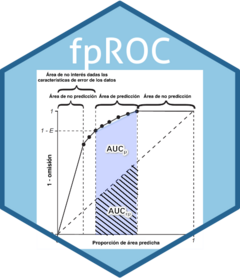

<!-- README.md is generated from README.Rmd. Please edit that file -->

```{r, include = FALSE}
knitr::opts_chunk$set(
  collapse = TRUE,
  comment = "#>",
  fig.path = "man/figures/README-",
  out.width = "100%"
)
```


<!-- badges: start -->
[](https://lifecycle.r-lib.org/articles/stages.html#stable)
[](https://app.codecov.io/gh/luismurao/fpROC)
[](https://CRAN.R-project.org/package=fpROC)
<!-- badges: end -->

# fpROC <a href="https://luismurao.github.io/fpROC/"></a>

The package features optimized C++ code for computing partial ROC. Parallelization using OpenMP (OMP) was achieved with assistance from the DeepSeek AI Assistant (https://deepseek.com).


The goal of fpROC is to ...

## Installation

You can install the development version of fpROC from [GitHub](https://github.com/) with:

``` r
# install.packages("pak")
pak::pak("luismurao/fpROC")
```

## Examples

The package can work with numerical vectors and `terra` SpatRaster objects.


An example using numerical data

```{r}
set.seed(999)
# With numeric vectors
test_data <- rnorm(100)
pred_data <- rnorm(100)
result <- fpROC::auc_metrics(test_prediction = test_data, prediction = pred_data)
```

An example using `terra` SpatRaster objects.

```{r}
set.seed(999)
# With SpatRaster
library(terra)
r <- terra::rast(ncol=10, nrow=10)
values(r) <- rnorm(ncell(r))
result <- fpROC::auc_metrics(test_prediction = test_data, prediction = r)
```

## Acknowledgments

CONACYT Ciencia de Frontera CF-2023-I-1156. Laboratorio Nacional de 
Biología del Cambio Climático, SECIHTI, México. To PAPIIT-UNAM IA202824 and 
PAPIIT-UNAM IA203922.RGC-D thanks the Dirección General de Asuntos del 
Personal Académico (DGAPA) from the UNAM, and the Secretaría de Ciencia, 
Humanidades, Tecnología e Innovación for her postdoctoral scholarship.
